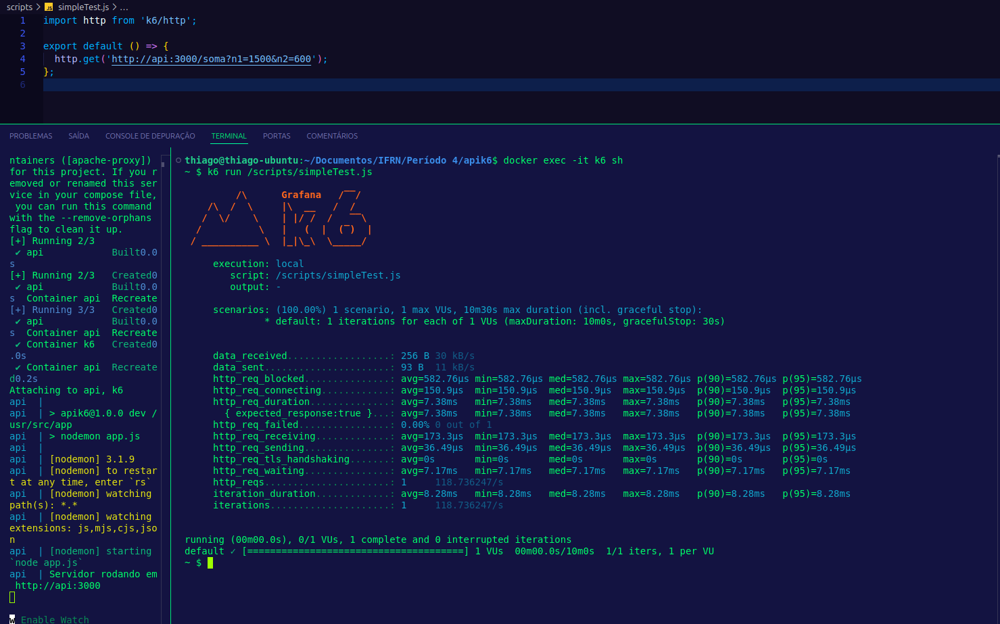
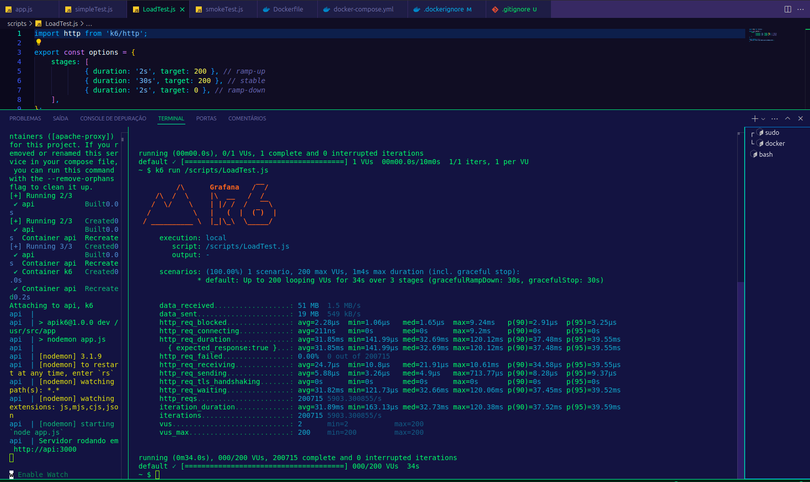
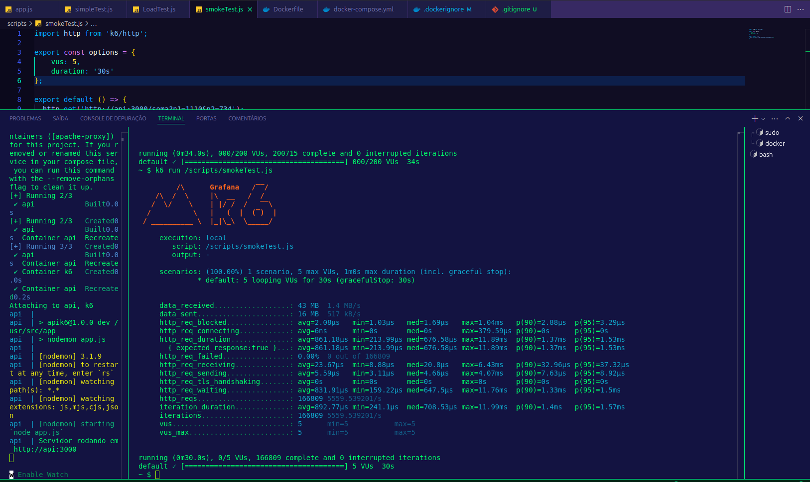

# Testes de Performance com K6 para API Node.js

Este projeto consiste em testar a performance de uma API Node.js desenvolvida com Express, utilizando o K6 para a execução de diferentes tipos de testes: simples, carga e fumaça.

## Estrutura da API

A API implementa um único endpoint que realiza a soma de dois números fornecidos como parâmetros na URL.

### Endpoint
- **URL:** `http://api:3000/soma`
- **Método:** `GET`
- **Parâmetros:**
  - `n1` (float): Primeiro número da soma.
  - `n2` (float): Segundo número da soma.
- **Resposta:**
  - Código 200: O resultado da soma.
  - Código 400: Mensagem de erro caso os parâmetros sejam inválidos.

### Exemplo de Requisição
```
GET http://api:3000/soma?n1=1500&n2=600
```
**Resposta:**
```
O resultado da soma é: 2100
```

## Testes Realizados

### 1. Simple Test
Teste básico para verificar o funcionamento do endpoint com uma única requisição.

#### Script
```javascript
import http from 'k6/http';

export default () => {
  http.get('http://api:3000/soma?n1=1500&n2=600');
};
```

---

### 2. Load Test
Teste de carga simulando 200 usuários simultâneos. O teste ocorre em três etapas:
- Ramp-up: Aumenta o número de usuários até 200 em 2 segundos.
- Stable: Mantém 200 usuários por 30 segundos.
- Ramp-down: Reduz os usuários para 0 em 2 segundos.

#### Script
```javascript
import http from 'k6/http';

export const options = {
  stages: [
    { duration: '2s', target: 200 },
    { duration: '30s', target: 200 },
    { duration: '2s', target: 0 },
  ],
};

export default () => {
  http.get('http://api:3000/soma?n1=5000&n2=700');
};
```

---

### 3. Smoke Test
Teste rápido para verificar a estabilidade do sistema com 5 usuários simultâneos por 30 segundos.

#### Script
```javascript
import http from 'k6/http';

export const options = {
  vus: 5,
  duration: '30s',
};

export default () => {
  http.get('http://api:3000/soma?n1=1110&n2=734');
};
```

---

## Resultados
Os resultados abaixo apresentam métricas obtidas para cada tipo de teste, incluindo a média e o percentil 95 (p(95)) para as métricas `http_req_duration` (tempo de resposta das requisições) e `http_req_failed` (percentual de requisições com falha). Também é apresentado o total de requisições realizadas (`http_reqs`).

### 1. Simple Test
- **http_req_duration:**
  - Média: 7.38ms
  - p(95): 7.38ms
- **http_req_failed:** 0.00%
- **http_reqs:** 1 requisição

### 2. Load Test
- **http_req_duration:**
  - Média: 32.69ms
  - p(95): 39.55ms
- **http_req_failed:** 0.00%
- **http_reqs:** 200715 requisições

### 3. Smoke Test
- **http_req_duration:**
  - Média: 676.58µs
  - p(95): 70ms
- **http_req_failed:** 0.00%
- **http_reqs:** 166809 requisições

---

## Imagens dos Resultados
As imagens dos gráficos e relatórios gerados durante os testes estão disponíveis na pasta `prints/`.

- **Simple Test:** 
- **Load Test:** 
- **Smoke Test:** 

---

## Ambiente de Execução
Todos os testes foram realizados dentro de um ambiente Docker para garantir a consistência do ambiente de desenvolvimento e teste.

### Comandos Docker Utilizados
1. **Construção do container:**
   ```bash
   sudo docker compose up --build
   ```
2. **Acessando cointainer k6:**
   ```bash
   docker exec -it k6 sh
   ```
2. **Execução dos testes:**
   ```bash
   k6 run /scripts/simpleTest.js
   k6 run /scripts/loadTest.js
   k6 run /scripts/smokeTest.js
   ```

---

## Conclusão
Os testes realizados mostraram que a API se comporta de forma eficiente e estável nas condições testadas. Durante o teste de carga, a API conseguiu atender 6.000 requisições sem falhas, com tempos de resposta dentro do esperado. O sistema também demonstrou estabilidade nos testes de fumaça e simples.

Esses resultados indicam que a API está pronta para uso em cenários similares ao ambiente de teste.
